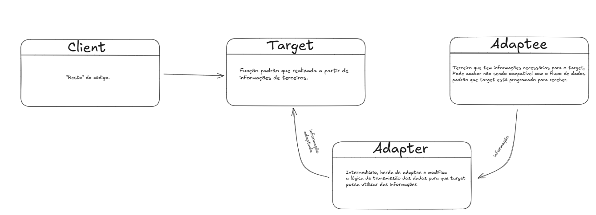

# Adapter

Adapter é um padrão estrutural de extrema importãncia para trabalho em conjunto ou softwares legado. Com ele, ferramentas que antes não trabalhariam juntaas devido a falta de compatibilidade podem usufruir de um adaptador que funciona como um "tradutor".

Os principais conceitos do adapter são 3:

## Target
Nada mais é do que o código que "precisa de tradução", ele recebe as informações adaptadas.

## Adaptee
Se trata daquilo que precisa ser adaptado.

## Adapter
O "tradutor", realiza a manipulação da lógica dos dados para que sejam convertidos e adaptados para o target, recebendo de adaptee.

